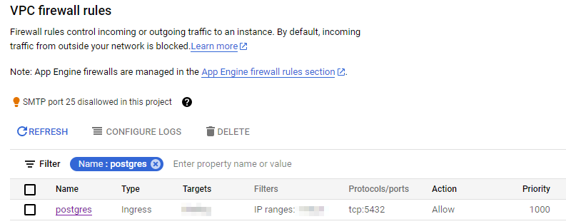
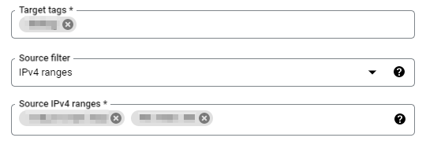
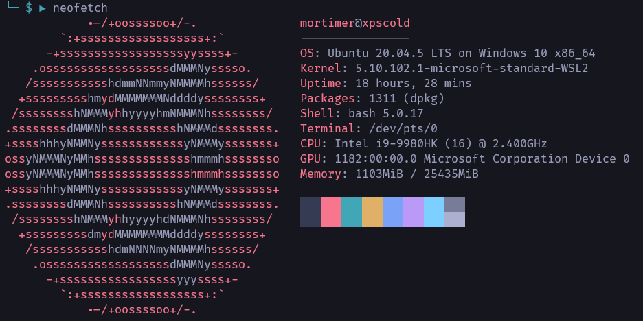
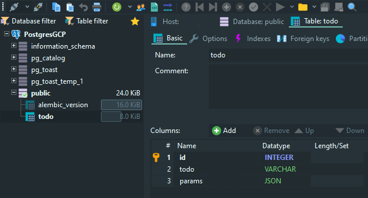
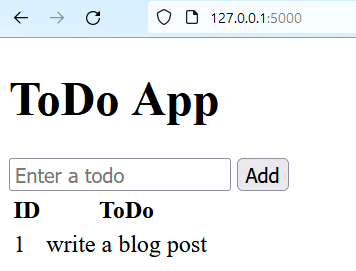
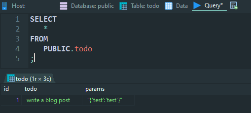

# Flask app connected to PostGres on remote machine

## IaaS Postgres

In this example I will be using a self managed Postgres database on a compute engine (IaaS). The main reason for this is I already had this setup and it is a cheap way of testing things. However, using a PaaS Postgres offering through something like these:

- AWS RDS [https://aws.amazon.com/rds/](https://aws.amazon.com/rds/)
- GCP Cloud SQL [https://cloud.google.com/sql](https://cloud.google.com/sql)
- Azure Database [https://azure.microsoft.com/en-us/products/postgresql/](https://azure.microsoft.com/en-us/products/postgresql/)

### Firewall

To get started with local development, we need to add a firewall rule such that our client machine can connect to the remote Postgres service running on the GCP cloud compute service.

In the GCP console, we create a new firewall rule.


In this example we name it _postgres_ and protocol/port is `tcp:5432`. The Target (tag) will be the tag we have used for the Compute engine.



Then, after finding out what our public IP address is (you can just ask Google _what is my ip address_) we allow our IP address through the firewall.



You will notice a second IP address allowed through the firewall, this will be for the deployed web appliction.

## Local development environment

I am using a Windows machine with:

- WSL 2 (Ubuntu 20.04)
- Python 3.8.10



```sh
sudo apt install libpq-dev
```

```sh
cd ~/venv
python3 -m venv fpg
source fpg/bin/activate
```

### Clone the git repository

### Create a `.env`

```ini
APP_SETTINGS=config.Config
DATABASE_URL="postgresql://<username>:<password>@<hostname>:<port>/<database>"
```

## Initiate the database

If you have configured everything else correctly, and have the correct connection string in your `.env` file, you should be able to initialise the database.

```sh
flask db init
```

```log
  Creating directory /flask-postgres/migrations ...  done
  Creating directory /flask-postgres/migrations/versions ...  done
  Generating /flask-postgres/migrations/script.py.mako ...  done
  Generating /flask-postgres/migrations/env.py ...  done
  Generating /flask-postgres/migrations/alembic.ini ...  done
  Generating /flask-postgres/migrations/README ...  done
  Please edit configuration/connection/logging settings in '/flask-postgres/migrations/alembic.ini' before proceeding.
```

```sh
flask db migrate
```

```log
INFO  [alembic.runtime.migration] Context impl PostgresqlImpl.
INFO  [alembic.runtime.migration] Will assume transactional DDL.
INFO  [alembic.autogenerate.compare] Detected added table 'todo'
  Generating /flask-postgres/migrations/versions/bc12dad5cf64_.py ...  done
```

```sh
flask db upgrade
```

```log
INFO  [alembic.runtime.migration] Context impl PostgresqlImpl.
INFO  [alembic.runtime.migration] Will assume transactional DDL.
INFO  [alembic.runtime.migration] Running upgrade 812916de9ad7 -> bc12dad5cf64, empty message
```



## Run the Flask appliction in development

```sh
python3 app.py
```

```log
* Serving Flask app 'app'
 * Debug mode: off
WARNING: This is a development server. Do not use it in a production deployment. Use a production WSGI server instead.
 * Running on http://127.0.0.1:5000
Press CTRL+C to quit
127.0.0.1 - - [02/Apr/2023 09:28:57] "GET / HTTP/1.1" 200 -
127.0.0.1 - - [02/Apr/2023 09:29:10] "GET / HTTP/1.1" 200 -
127.0.0.1 - - [02/Apr/2023 09:29:11] "GET /favicon.ico HTTP/1.1" 404 -
127.0.0.1 - - [02/Apr/2023 09:30:02] "POST /add HTTP/1.1" 302 -
127.0.0.1 - - [02/Apr/2023 09:30:03] "GET / HTTP/1.1" 200 -
```

### Test the appliction works

With a sample item in the todo, we can test that the appliction is writing to the cloud IaaS Postgres instance.





## Deploy the appliction
