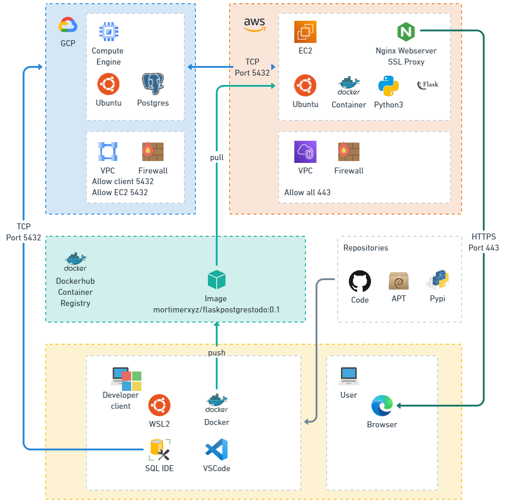
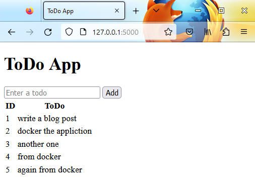
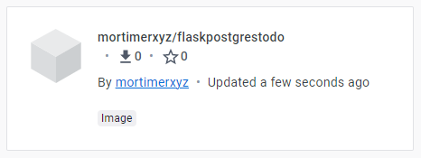
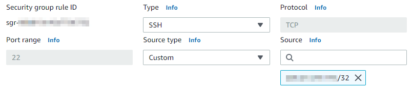
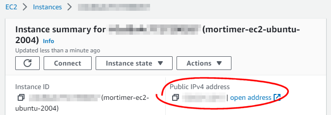
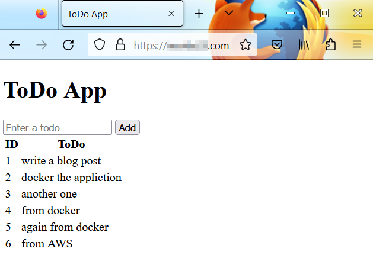

# Flask app connected to PostGres on remote machine

## Background

We are building out an application that has a decoupled RDBMS from a Front end in a multi cloud environment. We want the front end to be containerised.



The choice atchitecture for this demonstration will be:

1. A self managed Postgres database on one cloud platform (GCP)
1. A self managed web server on a different cloud platform (AWS)
1. A local Windows client development environment

## The Postgres Database (IaaS)

In this example I will be using a self managed Postgres database on a compute engine (Infrastructure as a Service). The main reason for this was that I already had this setup. It is a cheap way of testing out architectures. However, using a PaaS Postgres offering through something like these would be beneficial for a production solution as won't need the overhead of managing upgrades and patching of the server OS:

- AWS RDS [https://aws.amazon.com/rds/](https://aws.amazon.com/rds/)
- GCP Cloud SQL [https://cloud.google.com/sql](https://cloud.google.com/sql)
- Azure Database [https://azure.microsoft.com/en-us/products/postgresql/](https://azure.microsoft.com/en-us/products/postgresql/)

### Firewall

To get started with local development, we need to add a firewall rule such that our client machine can connect to the remote Postgres service running on the GCP cloud compute service.

In the GCP console, we create a new firewall rule.


In this example we name it _postgres_ and the protocol/port is `tcp:5432` (the default port for Postgres). The Target (tag) will be the tag we have used for the Compute engine.


Then, after finding out what our public IP address is (you can just ask Google _what is my ip address_) we allow our IP address through the firewall.


You will notice there is a second IP address allowed through the firewall. This is the web server machine's IP address which will be discussed later in the blog post.

## Local development environment

I am using a Windows machine with:

- WSL 2 (Ubuntu 20.04)
- Python 3.8.10


To get started there is an OS dependency we need to install:

```sh
sudo apt install libpq-dev
```

Now we will create a Python virtual environment for the development.

```sh
cd ~/venv
python3 -m venv fpg
source fpg/bin/activate
```

### Clone the git repository

The Github repository to follow is [https://github.com/mortie23/flask-postgres](https://github.com/mortie23/flask-postgres).

### Create a `.env` in the root of the repository

```ini
APP_SETTINGS=config.Config
DATABASE_URL="postgresql://<username>:<password>@<hostname>:<port>/<database>"
```

## Initiate the database

If you have configured everything else correctly, and have the correct connection string in your `.env` file, you should be able to initialise the database.

```sh
flask db init
```

```log
  Creating directory /flask-postgres/migrations ...  done
  Creating directory /flask-postgres/migrations/versions ...  done
  Generating /flask-postgres/migrations/script.py.mako ...  done
  Generating /flask-postgres/migrations/env.py ...  done
  Generating /flask-postgres/migrations/alembic.ini ...  done
  Generating /flask-postgres/migrations/README ...  done
  Please edit configuration/connection/logging settings in '/flask-postgres/migrations/alembic.ini' before proceeding.
```

```sh
flask db migrate
```

```log
INFO  [alembic.runtime.migration] Context impl PostgresqlImpl.
INFO  [alembic.runtime.migration] Will assume transactional DDL.
INFO  [alembic.autogenerate.compare] Detected added table 'todo'
  Generating /flask-postgres/migrations/versions/bc12dad5cf64_.py ...  done
```

```sh
flask db upgrade
```

```log
INFO  [alembic.runtime.migration] Context impl PostgresqlImpl.
INFO  [alembic.runtime.migration] Will assume transactional DDL.
INFO  [alembic.runtime.migration] Running upgrade 812916de9ad7 -> bc12dad5cf64, empty message
```


## Run the Flask application in development

```sh
python3 app.py
```

```log
* Serving Flask app 'app'
 * Debug mode: off
WARNING: This is a development server. Do not use it in a production deployment. Use a production WSGI server instead.
 * Running on http://127.0.0.1:5000
Press CTRL+C to quit
127.0.0.1 - - [02/Apr/2023 09:28:57] "GET / HTTP/1.1" 200 -
127.0.0.1 - - [02/Apr/2023 09:29:10] "GET / HTTP/1.1" 200 -
127.0.0.1 - - [02/Apr/2023 09:29:11] "GET /favicon.ico HTTP/1.1" 404 -
127.0.0.1 - - [02/Apr/2023 09:30:02] "POST /add HTTP/1.1" 302 -
127.0.0.1 - - [02/Apr/2023 09:30:03] "GET / HTTP/1.1" 200 -
```

### Test the appliction works

With a sample item in the todo, we can test that the appliction is writing to the cloud IaaS Postgres instance.


## Deploy the application

### Create a docker image of the Flask application

```sh
docker build -t mortimerxyz/flaskpostgrestodo:0.1 .
```

```log
[+] Building 2.3s (10/10) FINISHED
 => [internal] load build definition from Dockerfile                                   0.0s
 => => transferring dockerfile: 326B                                                   0.0s
 => [internal] load .dockerignore                                                      0.0s
 => => transferring context: 2B                                                        0.0s
 => [internal] load metadata for docker.io/library/python:3.8-buster                   2.2s
 => [auth] library/python:pull token for registry-1.docker.io                          0.0s
 => [1/5] FROM docker.io/library/python:3.8-buster@sha256:0e41815385213a2be1c61f182f7  0.0s
 => [internal] load build context                                                      0.0s
 => => transferring context: 220B                                                      0.0s
 => CACHED [2/5] COPY app.py config.py database.py models.py requirements.txt /        0.0s
 => CACHED [3/5] COPY templates templates/                                             0.0s
 => CACHED [4/5] RUN pip install -r requirements.txt                                   0.0s
 => exporting to image                                                                 0.0s
 => => exporting layers                                                                0.0s
 => => writing image sha256:bd1fffc6a1154c85937d98c320e186afeb8e6a0e39bac848fb1151bdd  0.0s
 => => naming to docker.io/mortimerxyz/flaskpostgrestodo:0.1                           0.0s
```

To see the built image:

```sh
docker images -a
```

```log
REPOSITORY                      TAG       IMAGE ID       CREATED             SIZE
mortimerxyz/flaskpostgrestodo   0.1       bd1fffc6a115   About an hour ago   986MB
```

This run statement passes the host machines environment variables for `APP_SETTINGS` and `DATABASE_URL` to the running Docker container.
This means that to get it running, you will not be able to depend on the `.env` file you have for development.
Since I am using a Windows host, the following PowerShell commands need to run to set the environment variables:

```ps1
$Env:APP_SETTINGS='config.Config'
$Env:DATABASE_URL="postgresql://<username>:<password>@<hostname>:<port>/<database>"
```

```sh
docker run --env APP_SETTINGS --env DATABASE_URL -p 5000:5000 mortimerxyz/flaskpostgrestodo:0.1
```

```log
[2023-04-02 01:40:51 +0000] [1] [INFO] Starting gunicorn 20.1.0
[2023-04-02 01:40:51 +0000] [1] [INFO] Listening at: http://0.0.0.0:5000 (1)
[2023-04-02 01:40:51 +0000] [1] [INFO] Using worker: sync
[2023-04-02 01:40:51 +0000] [8] [INFO] Booting worker with pid: 8
```



### Stop the running container

```sh
docker ps
```

```log
CONTAINER ID   IMAGE                               COMMAND                  CREATED
STATUS         PORTS                    NAMES
fd611c4ff1ff   mortimerxyz/flaskpostgrestodo:0.1   "gunicorn -b 0.0.0.0…"   6 minutes ago   Up 6 minutes   0.0.0.0:5000->5000/tcp   nice_mclaren
```

```sh
docker stop fd611c4ff1ff
```

### Publish the image to a container registry

We now need to push the image to a container registry so we can pull it from our deployment service.

```sh
docker push mortimerxyz/flaskpostgrestodo:0.1
```



### Use the Docker image to deploy application

We are going to use a basic EC2 machine to host the web application.
To enable us to SSH to the machine we will need to add a firewall rule to allow SSH over port 22 to our public IP address:  


We will also need to add the public IP address of the EC2 machine to the firewall for the GCP machine that is hosting the Postgres database service:



First we will start with pulling the Docker image down from where we published it to Docker hub.

```sh
docker pull mortimerxyz/flaskpostgrestodo:0.1
```

```log
0.1: Pulling from mortimerxyz/flaskpostgrestodo
4e2befb7f5d1: Pull complete
792af667f626: Pull complete
3e37868ebf66: Pull complete
591fe17e35dd: Pull complete
b9cba6e3073a: Pull complete
8d8bcef47b1e: Pull complete
920891d7496a: Pull complete
a2b9eb6d3f8d: Pull complete
eb27f9541dc2: Pull complete
579045be23fb: Pull complete
77f0ef020355: Pull complete
96bf4b83abf5: Pull complete
Digest: sha256:b020a3438a47ee535bb78afec1f9ab590cf73b66f74b2b94c469d84dfca93b14
Status: Downloaded newer image for mortimerxyz/flaskpostgrestodo:0.1
docker.io/mortimerxyz/flaskpostgrestodo:0.1
```

Since we are now using a Linux host, the following Bash commands need to run to set the environment variables:

```sh
export APP_SETTINGS=config.Config
export DATABASE_URL="postgresql://<username>:<password>@<hostname>:<port>/<database>"
```

We need to run the Docker container in detached mode:

```sh
docker run --detach --env APP_SETTINGS --env DATABASE_URL -p 5000:5000 mortimerxyz/flaskpostgrestodo:0.1
```

This EC2 machine already has Nginx installed and an associated SSL certificate and a domain name (this is outside the scope of this blog post).

We need to configure a server rule to proxy pass the service running on port 5000 to the SSL port 443 in the default Nginx configuration file (`/etc/nginx/sites-available/default`).

```conf
location / {
  proxy_pass http://localhost:5000;
  proxy_redirect http://localhost:5000/ $scheme://$http_host/;
  proxy_http_version 1.1;
  proxy_set_header Upgrade $http_upgrade;
  proxy_set_header Connection $connection_upgrade;
  proxy_read_timeout 20d;
}
```

Now when we browse to the domain name we get the running Flask application.


